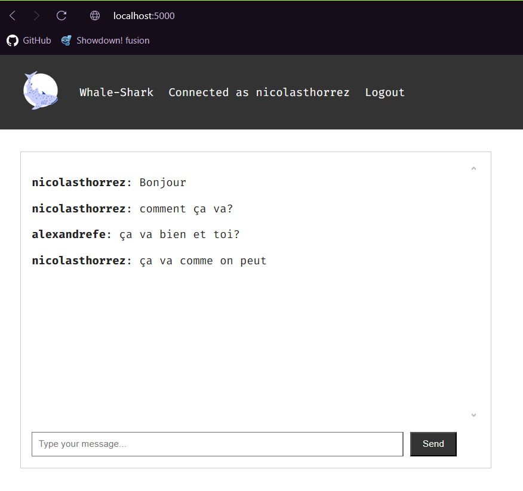

# DEVOPS FALL 2024 PROJECT featuring Alexandre Fenayrou and Nicolas Thorrez
In this report, we will go over all the features of our app and how to deploy it.
## 1: The app
### What does it do?
Our app is a chat app. As simple as it may seem, we created an app that let's a user chat in real time in a global chat-room with other users.
One can : 
- Register using an email adress, username and password (note that both email and username can't be re-used by others who want to sign in) : 
- Login using email and password : 
- Chat in the chat-room : 
Note that texts can't be deleted nor can accounts.

### How was it made?
The app is made using *python flask* for back-end and *html css* as front-end. It is very likely that you are already familiar with this technology but we weren't. As we did not have the Web Technologies class this semester we learned from scratch what *routes* are and how they work. Notice that we also used a new database model, *mongodb*, which we have seen in a different class. The main issues we encountered during this project were:
- The Socket : how does it work and why does it not work sometimes.
- Windows/Linux compatibilities : As we don't use any Linux/Unix operating system on our machines it has been a hustle to do things the such as Ansible and Istio.

We are using [wait-for-it.sh](https://github.com/vishnubob/wait-for-it/blob/master/wait-for-it.sh), a powerful shell tool that helps us time the interaction between MongoDB and the app.

The MongoDB database is made of 2 collections: messages and users : 

### How to deploy the app?
You can run the app:
- Locally as long as you have *python3 and MongoDB* on your computer using the *run.py* file.
- On *Docker* using *docker compose up* in the directory where the file *docker-compose.yml* is.
- On *Vagrant* using the *Vagrantfile*, we might not have *Ansible* ready but we can host the app on vagrant.
- On *Kubernetes*, using the *k8s deployments* we can run the application in multiple pods.

Once running you can access it through: [Localhost:5000](http://localhost:5000)

## 2: CI/CD
We created some github actions that help us test our app everytime we push. These are simple unit tests and functionality tests that you can see in the [tests](/tests/) folder, they are run through the [.github/workflows/test.yml](/.github/workflows/test.yml) : 

## 3: Virtual Env + *IaC*
### Virtual Environment using *Vagrant*
Through our *Vagrantfile*, our application can be run on *Vagrant* and exposed to the Localhost:5000 : 

### *IaC* using *Ansible*
Even though we tried our very best to make ansible work on Windows, it is definitly not made for it and we stand defeated by it. We though have some Ansible playbook.yml and Inventory.ini.

## 4 and 5: *Docker* image and *docker-compose*
### Docker image using *Dockerfile*
The Dockerfile is fairly simple, as we only get the components from the [/app](/app/) Directory plus [wait-for-it.sh](wait-for-it.sh).

### *docker-compose.yml*
*"docker compose up"* is probably the lign we ran the most during all the project. In the *docker-compose.yml* we've implemented volumes as to make our testing easier. Our deployment is made of two containers:
- One for the app
- One for *MongoDB*

(note that volumes can too be removed using -v while removing.)

## 6: Container Orchestration using *Kubernetes*
To use *Kubernetes* we used *Minikube*, as learned in class.
Our [/k8s](/k8s/) file is the place where our yml files for deployments, connection with db, services and persistent volumes are stored.
Once they are added to *kube*, we have 3 pods in total: 2 for the deployment and 1 for the database : 

Once our pods are running, we've tested they're working by exposing them to a port of our computer and using them localy : 

we ask you to: 
- log into *Docker* and push the image of this *Dockerfile* in your account
- change lign 19 of [deployment.yml](/k8s/deployment.yml) where you can find alexandrefenayrou/flask-chat-app:latest to put your image

If you find anything sketchy in the repo about the k8s file, just know that Nicolas Thorrez did it on Alexandre Fenayrou's machine and pushed in there. To get the blame updated, commits were done to revert and then repush.

## 7: Service mesh using Istio
We did not succeed in completing this task, as we could not finish the lab on Istio in the first place. It is hard to do on Windows.